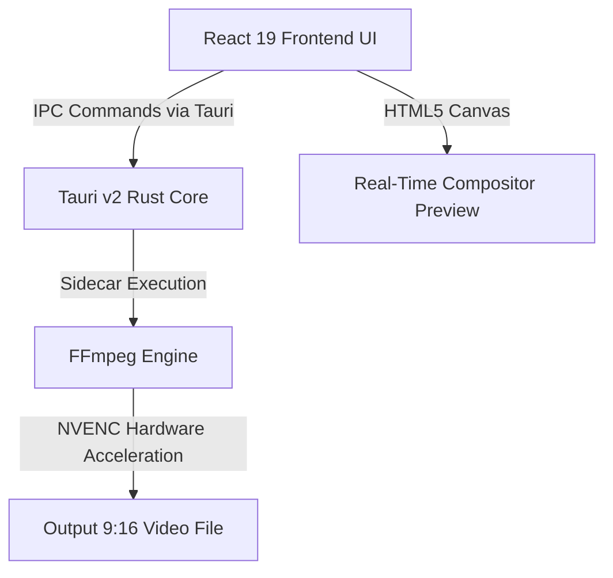

<div align="center">

# 🎬 ReframeGG

### *Transform Horizontal Video Content into Viral Vertical Formats in Seconds.*

[](https://react.dev)
[](https://typescriptlang.org)
[](https://tailwindcss.com)
[](https://tauri.app)
[](https://ffmpeg.org)

<p align="center">
  <a href="#-key-features">Key Features</a> •
  <a href="#-architecture">Architecture</a> •
  <a href="#-getting-started">Getting Started</a> •
  <a href="#-development-flow">Development</a> •
  <a href="#-custom-presets">Presets</a>
</p>

---

</div>

## ✨ Introduction

**ReframeGG** is a high-performance, premium, locally-hosted desktop application designed to reframe traditional **horizontal (16:9)** videos into vertical **(9:16)** formats optimized for TikTok, YouTube Shorts, and Instagram Reels. 

By combining the lightweight security of **Tauri v2**, the dynamic reactive UI of **React 19**, and the pixel-perfect rendering capability of **FFmpeg**, ReframeGG enables gaming creators and video editors to perform complex multi-layer reframing, masking, and color adjustments locally on their machines with zero cloud costs or privacy concerns.

---

## 🚀 Key Features

*   🎨 **Freeform Polygon Masking:** Break free from generic squares and circles. Draw completely custom polygonal masks in real-time to isolate elements like facecams, minimaps, health bars, or kill feeds.
*   ⚡ **Zero-Stutter Compositor:** Experience continuous, 60 FPS previews utilizing high-performance HTML5 canvas scaling and custom rendering loops powered by `requestAnimationFrame`.
*   🚀 **Hardware Accelerated Render:** Automatically detects and integrates GPU-accelerated encoding (`h264_nvenc`, `vp9_nvenc`) via your NVIDIA or AMD graphics card for blazing-fast export times.
*   💾 **Sleek Custom Presets:** Create, edit, and locally save your complex multi-layer layouts. Auto-suggestions recommend presets based on game filenames.
*   🎛️ **Pixel-Perfect Micro-Adjustments:** Precise increment/decrement step buttons on every single transform, crop, contrast, brightness, and feather controller for ultimate precision.
*   🔒 **100% Offline & Private:** Your video files never leave your system. Everything is processed directly, locally, and securely.

---

## 🛠 Architecture

ReframeGG is split into a robust frontend and a highly optimized desktop core:



*   **Frontend (`src/`)**: React 19 + TypeScript + Tailwind CSS v4. Operates the multi-panel editor view (Source & Mask Monitor, Silhouette View, and Program View), track bar scrubbing, and active layer controls.
*   **Backend (`src-tauri/`)**: Tauri v2 (Rust). Interacts with local storage, handles file picking via native system dialogs, and constructs advanced complex filter graphs (`-filter_complex`) to stream real-time progress events back to the UI.

---

## 📦 Getting Started

### Prerequisites

To build and run ReframeGG locally, make sure you have the following:

1.  **Node.js** (v18 or higher)
2.  **Rust Toolchain** (latest stable release)
3.  **Tauri Prerequisites** (e.g., C++ build tools for Windows)
4.  **FFmpeg** available in your system path, or bundled in `src-tauri/binaries/` (specifically `ffmpeg-x86_64-pc-windows-msvc.exe` on Windows).

### Installation

Clone the repository and install the frontend dependencies:

```bash
git clone https://github.com/MehmetCanWT/ReframeGG.git
cd ReframeGG
npm install
```

---

## 💻 Development Flow

To start the Vite hot-reloading development server and open the desktop Tauri window simultaneously:

```bash
npm run dev
```

### Building for Distribution

To bundle the application, compile the React assets, and package the Tauri Rust application into a production-ready installer executable:

```bash
npm run build
```

---

## 🎯 Custom Presets

ReframeGG loads custom layouts and structures using a clean, portable JSON schema. Wiped presets allow you to start fresh, build game-specific templates, and persist them natively in `localStorage` for automatic, effortless recovery next time you import a video clip.

```json
[
  {
    "game": "Custom",
    "presetName": "My Layout",
    "sourceResolution": { "w": 1920, "h": 1080 },
    "layers": []
  }
]
```

---

## 📜 License

Distributed under the **MIT License**. See `LICENSE` for more information.

<div align="center">
  <p>Made with ❤️ for Gaming Content Creators.</p>
</div>
